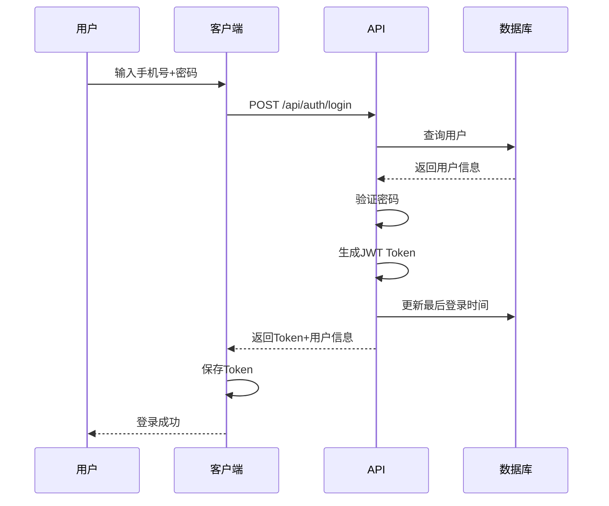
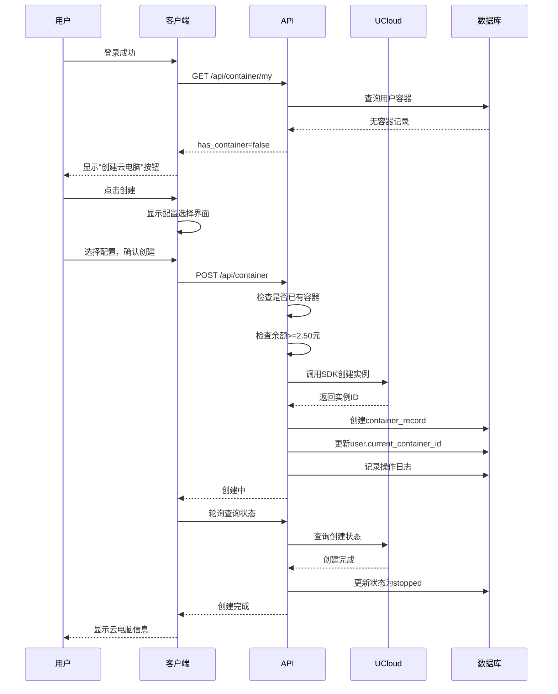
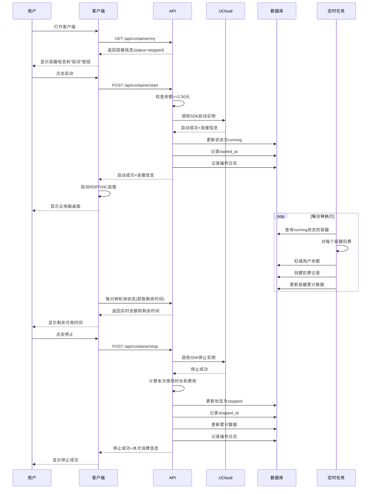
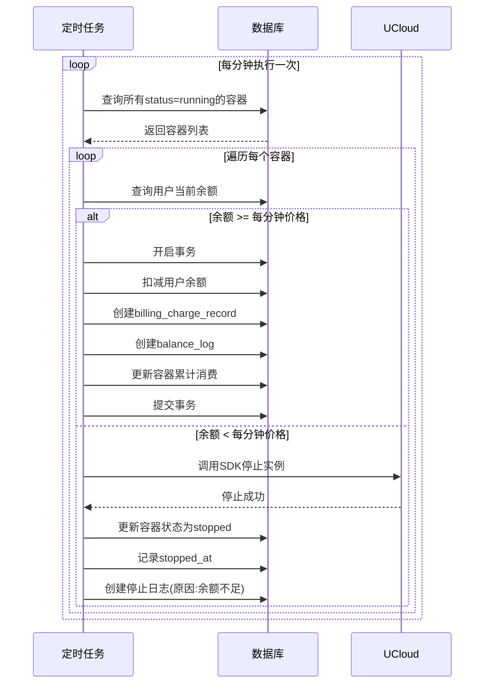
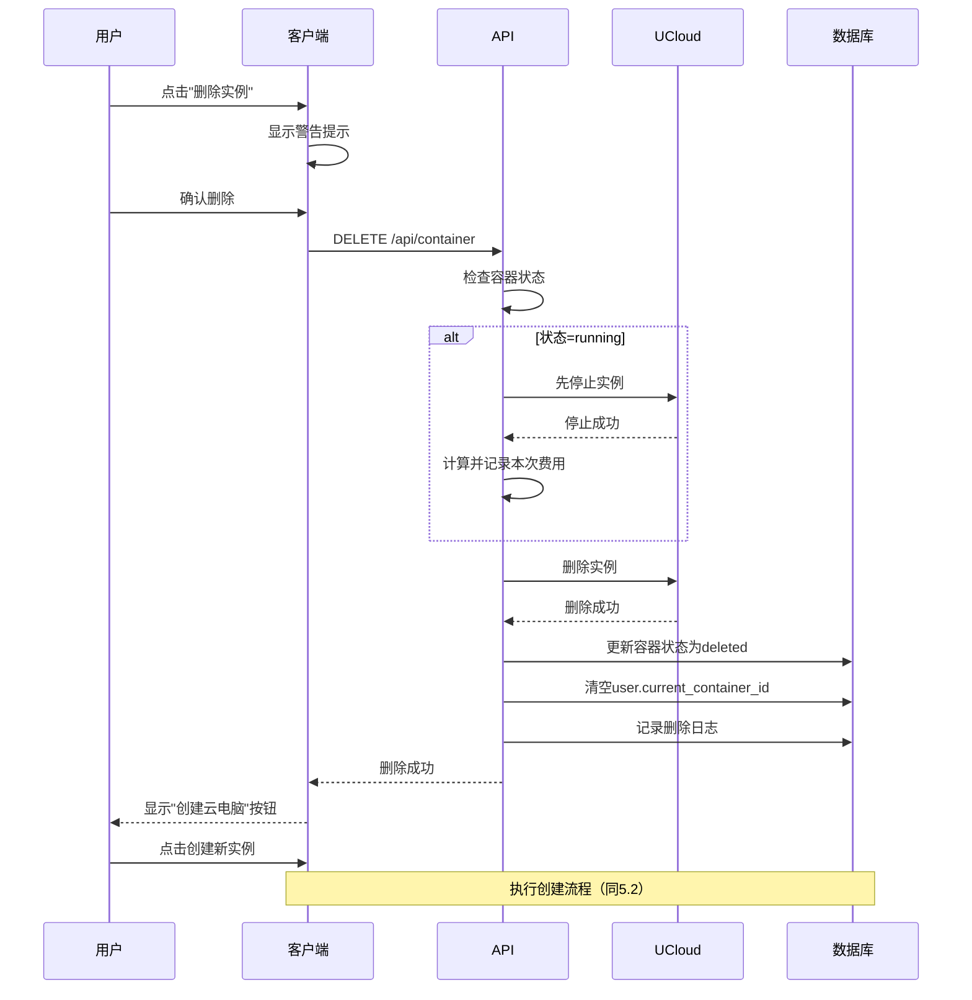
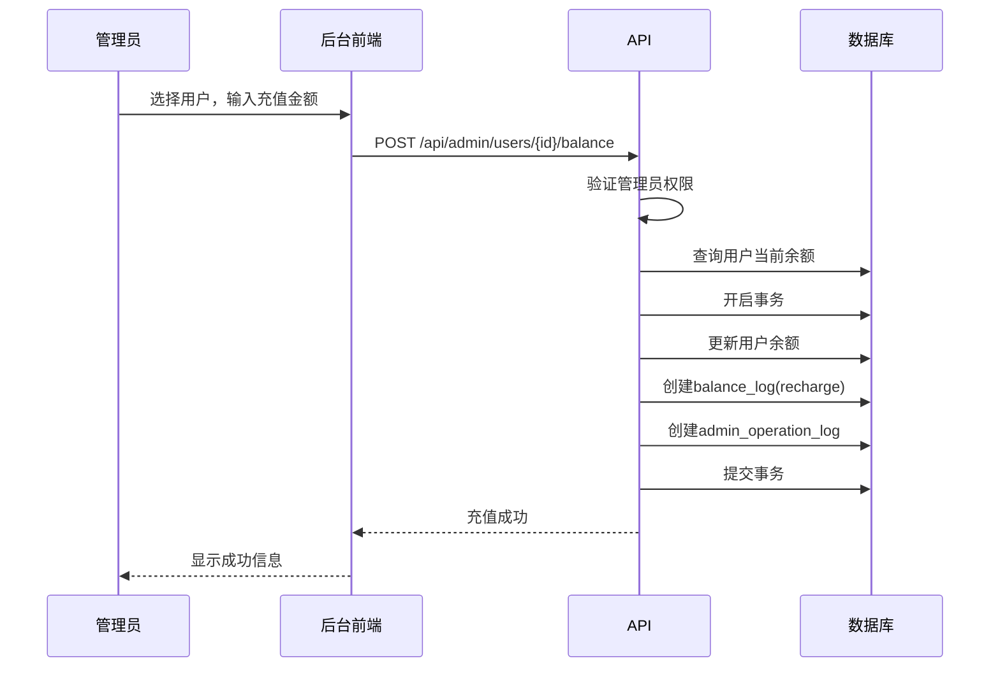
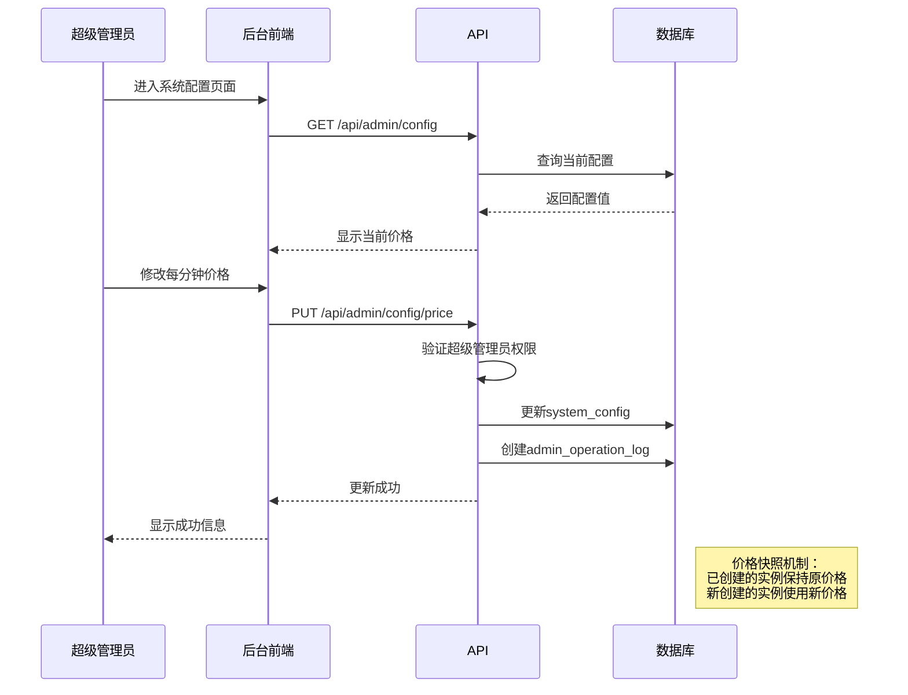

# 云电脑容器管理系统 - 完整设计文档

## 版本信息
- **版本**: v1.0
- **日期**: 2026-02-09
- **状态**: 设计完成

---

## 目录
1. [项目概述](#1-项目概述)
2. [核心业务逻辑](#2-核心业务逻辑)
3. [数据库设计](#3-数据库设计)
4. [API接口设计](#4-api接口设计)
5. [业务流程详解](#5-业务流程详解)
6. [后台管理功能](#6-后台管理功能)
7. [客户端设计](#7-客户端设计)
8. [定时任务](#8-定时任务)
9. [项目结构](#9-项目结构)
10. [关键业务规则](#10-关键业务规则)

---

## 1. 项目概述

### 1.1 项目核心特点
| 特性 | 说明 |
|------|------|
| 容器管理 | 基于UCloud的GPU云电脑服务 |
| 按需计费 | 按实际运行时长计费，每分钟自动扣费 |
| 1:1绑定 | 一个用户绑定一个云电脑实例 |
| 持久化实例 | 关机后保留实例状态和数据 |
| 日志记录 | 完整的操作日志和扣费记录追踪 |
| 权限管理 | 超级管理员 + 管理员 + 用户三级权限 |

### 1.2 技术栈

| 模块 | 技术 |
|------|------|
| 后端（服务端） | Python + FastAPI + SQLAlchemy + SQLite |
| 后台管理前端 | Vue 3 + Vite + Element Plus |
| 本地客户端 | Python + PySide6 |
| 认证 | JWT（PyJWT） |
| 云服务商 | UCloud SDK |

### 1.3 核心概念

- **用户**: 使用云电脑的企业客户，1:1绑定一个云电脑实例
- **超级管理员**: 系统最高权限，可管理所有管理员、设置价格、查看所有数据
- **管理员**: 可管理用户数据、充值余额、查看日志
- **云电脑实例**: UCloud提供的GPU云主机，按运行时长计费
- **每分钟价格**: 由超级管理员设置的系统全局价格（元/分钟）

---

## 2. 核心业务逻辑

### 2.1 绑定关系
```
用户(m_user) ←──1:1──→ 云电脑实例(container_record)
```

- 一个用户只能拥有一个非删除状态的云电脑实例
- 创建新实例前必须先删除旧实例
- 用户通过`current_container_id`字段关联当前实例

### 2.2 实例生命周期

```
┌─────────────────────────────────────────────────────────────────────┐
│                        实例状态流转图                                 │
└─────────────────────────────────────────────────────────────────────┘

创建实例
    ↓
已停止(stopped) ←──────┐
    ↓                  │
启动                  │
    ↓                  │
运行中(running) ───────┤
    ↓                  │
停止                  │
    ↓                  │
已停止(stopped) ───────┘
    ↓
删除实例
    ↓
已删除(deleted)
```

**状态说明**:
- **creating**: 创建中，等待UCloud返回
- **stopped**: 已停止，实例保留，数据不丢失，不计费
- **running**: 运行中，正常计费
- **stopping**: 停止中
- **starting**: 启动中
- **deleting**: 删除中
- **deleted**: 已删除，数据丢失
- **error**: 异常状态

### 2.3 计费模式

| 项目 | 说明 |
|------|------|
| 计费粒度 | 按分钟计费 |
| 扣费频率 | 每分钟自动扣费一次（后台定时任务） |
| 价格设置 | 超级管理员在系统配置中设置全局统一价 |
| 启动门槛 | 余额必须 >= 5分钟费用（防止频繁启停） |
| 余额不足 | 余额<=0时立即自动停止实例 |
| 价格快照 | 创建实例时记录当时的每分钟价格，防止中途调价 |

---

## 3. 数据库设计

### 3.1 用户表 (m_user)

```sql
CREATE TABLE m_user (
    id INTEGER PRIMARY KEY AUTOINCREMENT,
    company_name VARCHAR(100) NOT NULL COMMENT '公司名称',
    contact_name VARCHAR(50) NOT NULL COMMENT '联系人姓名',
    phone VARCHAR(20) NOT NULL UNIQUE COMMENT '联系电话（登录账号）',
    password_hash VARCHAR(255) NOT NULL COMMENT '密码哈希（bcrypt）',
    balance DECIMAL(10,2) DEFAULT 0.00 COMMENT '账号余额（元）',
    current_container_id INTEGER DEFAULT NULL COMMENT '当前绑定的容器ID',
    status INTEGER DEFAULT 1 COMMENT '状态：0-禁用, 1-正常',
    created_at DATETIME DEFAULT CURRENT_TIMESTAMP,
    updated_at DATETIME DEFAULT CURRENT_TIMESTAMP,
    last_login_at DATETIME DEFAULT NULL,
    
    FOREIGN KEY (current_container_id) REFERENCES container_record(id)
);

CREATE INDEX idx_user_phone ON m_user(phone);
CREATE INDEX idx_user_status ON m_user(status);
```

### 3.2 管理员表 (m_admin)

```sql
CREATE TABLE m_admin (
    id INTEGER PRIMARY KEY AUTOINCREMENT,
    username VARCHAR(50) NOT NULL UNIQUE COMMENT '管理员账号',
    password_hash VARCHAR(255) NOT NULL COMMENT '密码哈希',
    role VARCHAR(20) NOT NULL DEFAULT 'admin' COMMENT '角色：super_admin/admin',
    status INTEGER DEFAULT 1 COMMENT '状态：0-禁用, 1-正常',
    created_by INTEGER DEFAULT NULL COMMENT '创建者ID（超级管理员）',
    created_at DATETIME DEFAULT CURRENT_TIMESTAMP,
    updated_at DATETIME DEFAULT CURRENT_TIMESTAMP,
    last_login_at DATETIME DEFAULT NULL,
    last_login_ip VARCHAR(50) DEFAULT NULL,
    
    FOREIGN KEY (created_by) REFERENCES m_admin(id)
);

CREATE INDEX idx_admin_username ON m_admin(username);
CREATE INDEX idx_admin_role ON m_admin(role);
```

### 3.3 容器记录表 (container_record)

```sql
CREATE TABLE container_record (
    id INTEGER PRIMARY KEY AUTOINCREMENT,
    user_id INTEGER NOT NULL UNIQUE COMMENT '所属用户ID（1:1绑定）',
    ucloud_instance_id VARCHAR(100) NOT NULL COMMENT 'UCloud实例ID',
    instance_name VARCHAR(100) NOT NULL COMMENT '实例名称',
    status VARCHAR(20) NOT NULL DEFAULT 'creating' COMMENT '状态',
    gpu_type VARCHAR(50) NOT NULL COMMENT 'GPU类型',
    cpu_cores INTEGER NOT NULL COMMENT 'CPU核数',
    memory_gb INTEGER NOT NULL COMMENT '内存大小(GB)',
    storage_gb INTEGER NOT NULL COMMENT '存储大小(GB)',
    price_per_minute DECIMAL(10,4) NOT NULL COMMENT '创建时的每分钟价格',
    created_at DATETIME DEFAULT CURRENT_TIMESTAMP,
    started_at DATETIME DEFAULT NULL COMMENT '本次启动时间（用于计费）',
    stopped_at DATETIME DEFAULT NULL COMMENT '本次停止时间',
    deleted_at DATETIME DEFAULT NULL,
    total_running_minutes INTEGER DEFAULT 0 COMMENT '累计运行分钟数',
    total_cost DECIMAL(10,2) DEFAULT 0.00 COMMENT '累计消费金额',
    
    FOREIGN KEY (user_id) REFERENCES m_user(id),
    UNIQUE(user_id)  -- 确保1:1绑定
);

CREATE INDEX idx_container_user ON container_record(user_id);
CREATE INDEX idx_container_status ON container_record(status);
CREATE INDEX idx_container_ucloud_id ON container_record(ucloud_instance_id);
```

### 3.4 系统配置表 (system_config)

```sql
CREATE TABLE system_config (
    id INTEGER PRIMARY KEY AUTOINCREMENT,
    config_key VARCHAR(50) NOT NULL UNIQUE COMMENT '配置项键名',
    config_value VARCHAR(255) NOT NULL COMMENT '配置项值',
    description TEXT COMMENT '配置描述',
    updated_by INTEGER DEFAULT NULL COMMENT '更新者ID',
    updated_at DATETIME DEFAULT CURRENT_TIMESTAMP,
    
    FOREIGN KEY (updated_by) REFERENCES m_admin(id)
);

-- 初始化数据
INSERT INTO system_config (config_key, config_value, description) VALUES
('price_per_minute', '0.5000', '云电脑每分钟价格（元）'),
('min_balance_to_start', '2.5000', '启动云电脑所需最低余额（5分钟费用）'),
('auto_stop_threshold', '0.0000', '自动停止余额阈值');
```

### 3.5 实时扣费记录表 (billing_charge_record)

```sql
CREATE TABLE billing_charge_record (
    id INTEGER PRIMARY KEY AUTOINCREMENT,
    user_id INTEGER NOT NULL COMMENT '用户ID',
    container_id INTEGER NOT NULL COMMENT '容器ID',
    charge_minute DATETIME NOT NULL COMMENT '扣费的这一分钟（精确到分钟）',
    price_per_minute DECIMAL(10,4) NOT NULL COMMENT '当时每分钟价格',
    amount DECIMAL(10,4) NOT NULL COMMENT '扣费金额',
    balance_before DECIMAL(10,2) NOT NULL COMMENT '扣费前余额',
    balance_after DECIMAL(10,2) NOT NULL COMMENT '扣费后余额',
    created_at DATETIME DEFAULT CURRENT_TIMESTAMP,
    
    FOREIGN KEY (user_id) REFERENCES m_user(id),
    FOREIGN KEY (container_id) REFERENCES container_record(id)
);

CREATE INDEX idx_charge_user ON billing_charge_record(user_id);
CREATE INDEX idx_charge_container ON billing_charge_record(container_id);
CREATE INDEX idx_charge_minute ON billing_charge_record(charge_minute);
CREATE INDEX idx_charge_created ON billing_charge_record(created_at);
```

### 3.6 余额变动记录表 (balance_log)

```sql
CREATE TABLE balance_log (
    id INTEGER PRIMARY KEY AUTOINCREMENT,
    user_id INTEGER NOT NULL COMMENT '用户ID',
    change_type VARCHAR(20) NOT NULL COMMENT '变动类型：recharge(充值)/deduct(扣费)/refund(退款)',
    amount DECIMAL(10,2) NOT NULL COMMENT '变动金额（正数充值，负数扣费）',
    balance_before DECIMAL(10,2) NOT NULL,
    balance_after DECIMAL(10,2) NOT NULL,
    related_id INTEGER DEFAULT NULL COMMENT '关联记录ID（billing_charge_record.id）',
    description TEXT COMMENT '描述说明',
    operator_id INTEGER DEFAULT NULL COMMENT '操作人ID（管理员充值时记录）',
    operator_type VARCHAR(20) DEFAULT 'user' COMMENT '操作人类型：user/admin/system',
    created_at DATETIME DEFAULT CURRENT_TIMESTAMP,
    
    FOREIGN KEY (user_id) REFERENCES m_user(id),
    FOREIGN KEY (operator_id) REFERENCES m_admin(id)
);

CREATE INDEX idx_balance_user ON balance_log(user_id);
CREATE INDEX idx_balance_type ON balance_log(change_type);
CREATE INDEX idx_balance_created ON balance_log(created_at);
```

### 3.7 容器操作日志表 (container_log)

```sql
CREATE TABLE container_log (
    id INTEGER PRIMARY KEY AUTOINCREMENT,
    user_id INTEGER NOT NULL COMMENT '操作用户ID',
    container_id INTEGER NOT NULL COMMENT '容器ID',
    action VARCHAR(50) NOT NULL COMMENT '操作：create/start/stop/delete/connect',
    action_status VARCHAR(20) NOT NULL COMMENT '状态：success/failed/pending',
    request_data TEXT COMMENT '请求参数（JSON）',
    response_data TEXT COMMENT '响应数据（JSON）',
    error_message TEXT COMMENT '错误信息',
    ip_address VARCHAR(50) COMMENT '操作IP',
    user_agent TEXT COMMENT '客户端信息',
    created_at DATETIME DEFAULT CURRENT_TIMESTAMP,
    
    FOREIGN KEY (user_id) REFERENCES m_user(id),
    FOREIGN KEY (container_id) REFERENCES container_record(id)
);

CREATE INDEX idx_container_log_user ON container_log(user_id);
CREATE INDEX idx_container_log_container ON container_log(container_id);
CREATE INDEX idx_container_log_action ON container_log(action);
CREATE INDEX idx_container_log_created ON container_log(created_at);
```

### 3.8 管理员操作日志表 (admin_operation_log)

```sql
CREATE TABLE admin_operation_log (
    id INTEGER PRIMARY KEY AUTOINCREMENT,
    admin_id INTEGER NOT NULL COMMENT '操作管理员ID',
    action VARCHAR(50) NOT NULL COMMENT '操作类型',
    target_type VARCHAR(50) NOT NULL COMMENT '操作对象类型：user/admin/config/container',
    target_id INTEGER COMMENT '操作对象ID',
    old_value TEXT COMMENT '修改前数据（JSON）',
    new_value TEXT COMMENT '修改后数据（JSON）',
    description TEXT COMMENT '操作描述',
    ip_address VARCHAR(50),
    created_at DATETIME DEFAULT CURRENT_TIMESTAMP,
    
    FOREIGN KEY (admin_id) REFERENCES m_admin(id)
);

CREATE INDEX idx_admin_log_admin ON admin_operation_log(admin_id);
CREATE INDEX idx_admin_log_target ON admin_operation_log(target_type, target_id);
CREATE INDEX idx_admin_log_created ON admin_operation_log(created_at);
```

### 3.9 E-R关系图

```
┌─────────────────┐     1:1      ┌─────────────────────┐
│    m_user       │◄────────────►│  container_record   │
│  - id (PK)      │              │  - id (PK)          │
│  - company_name │              │  - user_id (FK, UK) │
│  - phone        │              │  - ucloud_id        │
│  - balance      │              │  - status           │
│  - current_     │              │  - price_per_minute │
│    container_id │              │  - total_cost       │
└─────────────────┘              └─────────────────────┘
         │                                │
         │ 1:N                            │ 1:N
         ▼                                ▼
┌─────────────────┐              ┌─────────────────────┐
│   balance_log   │              │ billing_charge_     │
│  - id (PK)      │              │   record            │
│  - user_id (FK) │              │  - id (PK)          │
│  - change_type  │              │  - user_id (FK)     │
│  - amount       │              │  - container_id(FK) │
└─────────────────┘              │  - amount           │
                                 │  - charge_minute    │
                                 └─────────────────────┘
                                          │
                                          │ N:1
                                          ▼
                                 ┌─────────────────────┐
                                 │   container_log     │
                                 │  - id (PK)          │
                                 │  - user_id (FK)     │
                                 │  - container_id(FK) │
                                 │  - action           │
                                 └─────────────────────┘

┌─────────────────┐              ┌─────────────────────┐
│    m_admin      │              │   system_config     │
│  - id (PK)      │              │  - id (PK)          │
│  - username     │              │  - config_key       │
│  - role         │              │  - config_value     │
│  - created_by   │              │  - updated_by (FK)  │
└─────────────────┘              └─────────────────────┘
         │
         │ 1:N
         ▼
┌─────────────────────┐
│ admin_operation_log │
│  - id (PK)          │
│  - admin_id (FK)    │
│  - action           │
│  - target_type      │
└─────────────────────┘
```

---

## 4. API接口设计

### 4.1 认证相关

#### 用户登录
```http
POST /api/auth/login
Content-Type: application/json

{
    "phone": "13800138000",
    "password": "user_password"
}
```

**响应**:
```json
{
    "code": 200,
    "message": "登录成功",
    "data": {
        "token": "eyJhbGciOiJIUzI1NiIsInR5cCI6IkpXVCJ9...",
        "token_type": "Bearer",
        "expires_in": 86400,
        "user": {
            "id": 1,
            "company_name": "ABC公司",
            "contact_name": "张三",
            "phone": "13800138000",
            "balance": 100.00,
            "current_container_id": 1
        }
    }
}
```

#### 管理员登录
```http
POST /api/auth/admin/login
Content-Type: application/json

{
    "username": "admin",
    "password": "admin_password"
}
```

#### 退出登录
```http
POST /api/auth/logout
Authorization: Bearer {token}
```

#### 刷新Token
```http
POST /api/auth/refresh
Authorization: Bearer {token}
```

### 4.2 用户相关（客户端）

#### 获取当前用户信息
```http
GET /api/user/me
Authorization: Bearer {token}
```

#### 修改密码
```http
PUT /api/user/password
Authorization: Bearer {token}
Content-Type: application/json

{
    "old_password": "old_pass",
    "new_password": "new_pass"
}
```

#### 获取余额和消费统计
```http
GET /api/user/statistics
Authorization: Bearer {token}

响应:
{
    "code": 200,
    "data": {
        "balance": 100.00,
        "total_cost": 500.00,
        "total_running_minutes": 1200,
        "today_cost": 25.50,
        "this_month_cost": 180.00
    }
}
```

### 4.3 容器相关（客户端）

#### 获取我的云电脑
```http
GET /api/container/my
Authorization: Bearer {token}

响应:
{
    "code": 200,
    "data": {
        "has_container": true,
        "container": {
            "id": 1,
            "instance_name": "云电脑-ABC公司",
            "status": "running",
            "gpu_type": "V100",
            "cpu_cores": 8,
            "memory_gb": 32,
            "storage_gb": 100,
            "price_per_minute": 0.50,
            "created_at": "2026-02-01T10:00:00",
            "started_at": "2026-02-09T08:30:00",
            "total_running_minutes": 120,
            "total_cost": 60.00
        }
    }
}
```

#### 获取实时状态（运行中时调用）
```http
GET /api/container/my/status
Authorization: Bearer {token}

响应:
{
    "code": 200,
    "data": {
        "status": "running",
        "current_running_minutes": 45,
        "current_session_cost": 22.50,
        "balance": 100.00,
        "price_per_minute": 0.50,
        "remaining_minutes": 200,  // 剩余可用分钟数
        "remaining_time_formatted": "3小时20分钟",  // 格式化显示
        "connection_info": {
            "host": "192.168.1.100",
            "port": 3389,
            "username": "user",
            "password": "temp_pass"
        }
    }
}
```

#### 创建云电脑
```http
POST /api/container
Authorization: Bearer {token}
Content-Type: application/json

{
    "gpu_type": "V100",
    "cpu_cores": 8,
    "memory_gb": 32,
    "storage_gb": 100,
    "instance_name": "云电脑-ABC公司"
}

响应:
{
    "code": 200,
    "message": "云电脑创建中",
    "data": {
        "container_id": 1,
        "status": "creating",
        "estimated_time": 120  // 预计创建时间（秒）
    }
}
```

**错误响应**:
```json
{
    "code": 400,
    "message": "您已有一个云电脑实例，请先删除后再创建",
    "error_code": "CONTAINER_ALREADY_EXISTS"
}
```

#### 启动云电脑
```http
POST /api/container/start
Authorization: Bearer {token}

响应:
{
    "code": 200,
    "message": "启动成功",
    "data": {
        "container_id": 1,
        "status": "running",
        "started_at": "2026-02-09T09:00:00",
        "connection_info": {
            "host": "192.168.1.100",
            "port": 3389,
            "username": "user",
            "password": "temp_pass"
        }
    }
}
```

**错误响应**:
```json
{
    "code": 402,
    "message": "余额不足，启动云电脑至少需要2.50元",
    "error_code": "INSUFFICIENT_BALANCE",
    "data": {
        "current_balance": 1.00,
        "required_balance": 2.50
    }
}
```

#### 停止云电脑
```http
POST /api/container/stop
Authorization: Bearer {token}

响应:
{
    "code": 200,
    "message": "停止成功",
    "data": {
        "container_id": 1,
        "status": "stopped",
        "stopped_at": "2026-02-09T10:30:00",
        "this_session": {
            "running_minutes": 90,
            "cost": 45.00
        },
        "total": {
            "running_minutes": 210,
            "cost": 105.00
        }
    }
}
```

#### 删除云电脑
```http
DELETE /api/container
Authorization: Bearer {token}

请求体:
{
    "confirm": true,  // 确认删除
    "reason": "重新创建"  // 删除原因（可选）
}

响应:
{
    "code": 200,
    "message": "删除成功，您可以创建新的云电脑",
    "data": {
        "deleted_at": "2026-02-09T11:00:00"
    }
}
```

**注意事项**:
- 运行中的实例会先停止再删除
- 删除后数据不可恢复
- 删除后才能创建新实例

#### 获取连接信息
```http
GET /api/container/connection
Authorization: Bearer {token}

响应:
{
    "code": 200,
    "data": {
        "connection_info": {
            "host": "192.168.1.100",
            "port": 3389,
            "username": "user",
            "password": "temp_pass"
        }
    }
}
```

### 4.4 账单相关（客户端）

#### 获取扣费记录
```http
GET /api/billing/charges?page=1&page_size=20&start_date=2026-02-01&end_date=2026-02-09
Authorization: Bearer {token}

响应:
{
    "code": 200,
    "data": {
        "total": 150,
        "page": 1,
        "page_size": 20,
        "items": [
            {
                "id": 1,
                "charge_minute": "2026-02-09T10:00:00",
                "price_per_minute": 0.50,
                "amount": 0.50,
                "balance_before": 50.50,
                "balance_after": 50.00,
                "created_at": "2026-02-09T10:00:05"
            }
        ],
        "summary": {
            "total_amount": 75.00,
            "total_minutes": 150
        }
    }
}
```

#### 获取余额变动记录
```http
GET /api/billing/balance-logs?page=1&page_size=20
Authorization: Bearer {token}

响应:
{
    "code": 200,
    "data": {
        "total": 50,
        "items": [
            {
                "id": 1,
                "change_type": "deduct",
                "amount": -0.50,
                "balance_before": 50.50,
                "balance_after": 50.00,
                "description": "云电脑使用扣费",
                "created_at": "2026-02-09T10:00:05"
            },
            {
                "id": 2,
                "change_type": "recharge",
                "amount": 100.00,
                "balance_before": 0.00,
                "balance_after": 100.00,
                "description": "管理员充值",
                "operator_name": "管理员A",
                "created_at": "2026-02-08T09:00:00"
            }
        ]
    }
}
```

### 4.5 系统配置（超级管理员）

#### 获取系统配置
```http
GET /api/admin/config
Authorization: Bearer {admin_token}

响应:
{
    "code": 200,
    "data": {
        "price_per_minute": 0.50,
        "min_balance_to_start": 2.50,
        "auto_stop_threshold": 0.00
    }
}
```

#### 更新每分钟价格
```http
PUT /api/admin/config/price
Authorization: Bearer {admin_token}
Content-Type: application/json

{
    "price_per_minute": 0.60
}

响应:
{
    "code": 200,
    "message": "价格更新成功",
    "data": {
        "old_price": 0.50,
        "new_price": 0.60,
        "affected_containers": 0,  // 0表示不影响已创建的实例
        "effective_time": "2026-02-09T12:00:00"
    }
}
```

**注意**: 价格更新只影响新创建的实例，已创建实例保持创建时的价格（价格快照机制）

### 4.6 用户管理（管理员）

#### 获取用户列表
```http
GET /api/admin/users?page=1&page_size=20&keyword=ABC&status=1
Authorization: Bearer {admin_token}

响应:
{
    "code": 200,
    "data": {
        "total": 100,
        "page": 1,
        "page_size": 20,
        "items": [
            {
                "id": 1,
                "company_name": "ABC公司",
                "contact_name": "张三",
                "phone": "13800138000",
                "balance": 100.00,
                "status": 1,
                "has_container": true,
                "container_status": "running",
                "created_at": "2026-02-01T10:00:00",
                "last_login_at": "2026-02-09T08:00:00"
            }
        ]
    }
}
```

#### 创建用户
```http
POST /api/admin/users
Authorization: Bearer {admin_token}
Content-Type: application/json

{
    "company_name": "XYZ公司",
    "contact_name": "李四",
    "phone": "13900139000",
    "password": "initial_password",
    "initial_balance": 0.00
}
```

#### 更新用户信息
```http
PUT /api/admin/users/{user_id}
Authorization: Bearer {admin_token}
Content-Type: application/json

{
    "company_name": "XYZ科技有限公司",
    "contact_name": "李四",
    "status": 1
}
```

#### 重置用户密码
```http
POST /api/admin/users/{user_id}/reset-password
Authorization: Bearer {admin_token}
Content-Type: application/json

{
    "new_password": "new_password_123"
}
```

#### 充值/扣减余额
```http
POST /api/admin/users/{user_id}/balance
Authorization: Bearer {admin_token}
Content-Type: application/json

{
    "type": "recharge",  // recharge:充值, deduct:扣减
    "amount": 100.00,
    "description": "春节活动赠送"
}

响应:
{
    "code": 200,
    "message": "充值成功",
    "data": {
        "user_id": 1,
        "balance_before": 50.00,
        "balance_after": 150.00,
        "change_amount": 100.00,
        "operation_id": 123
    }
}
```

#### 获取用户详情
```http
GET /api/admin/users/{user_id}
Authorization: Bearer {admin_token}

响应:
{
    "code": 200,
    "data": {
        "user": {
            "id": 1,
            "company_name": "ABC公司",
            "contact_name": "张三",
            "phone": "13800138000",
            "balance": 100.00,
            "status": 1,
            "created_at": "2026-02-01T10:00:00",
            "updated_at": "2026-02-09T10:00:00",
            "last_login_at": "2026-02-09T08:00:00"
        },
        "container": {
            "id": 1,
            "status": "running",
            "total_cost": 500.00,
            "total_running_minutes": 1200
        },
        "statistics": {
            "today_cost": 25.00,
            "this_month_cost": 180.00,
            "total_cost": 500.00
        }
    }
}
```

### 4.7 管理员管理（超级管理员）

#### 获取管理员列表
```http
GET /api/admin/admins?page=1&page_size=20
Authorization: Bearer {super_admin_token}
```

#### 创建管理员
```http
POST /api/admin/admins
Authorization: Bearer {super_admin_token}
Content-Type: application/json

{
    "username": "new_admin",
    "password": "admin_pass",
    "role": "admin"  // admin:普通管理员, super_admin:超级管理员
}
```

#### 更新管理员
```http
PUT /api/admin/admins/{admin_id}
Authorization: Bearer {super_admin_token}
Content-Type: application/json

{
    "status": 0,  // 禁用
    "role": "admin"
}
```

#### 删除管理员
```http
DELETE /api/admin/admins/{admin_id}
Authorization: Bearer {super_admin_token}

注意: 不能删除自己
```

#### 重置管理员密码
```http
POST /api/admin/admins/{admin_id}/reset-password
Authorization: Bearer {super_admin_token}
Content-Type: application/json

{
    "new_password": "new_password"
}
```

### 4.8 日志查询（管理员）

#### 获取容器操作日志
```http
GET /api/admin/logs/containers?page=1&page_size=20&user_id=1&action=start&start_date=2026-02-01
Authorization: Bearer {admin_token}
```

#### 获取余额变动日志
```http
GET /api/admin/logs/balance?page=1&page_size=20&user_id=1&change_type=recharge
Authorization: Bearer {admin_token}
```

#### 获取管理员操作日志（仅超级管理员）
```http
GET /api/admin/logs/admin-operations?page=1&page_size=20&admin_id=1
Authorization: Bearer {super_admin_token}
```

#### 获取扣费记录
```http
GET /api/admin/logs/charges?page=1&page_size=20&user_id=1&start_date=2026-02-01
Authorization: Bearer {admin_token}
```

### 4.9 仪表盘统计（管理员）

#### 获取系统概览
```http
GET /api/admin/dashboard
Authorization: Bearer {admin_token}

响应:
{
    "code": 200,
    "data": {
        "overview": {
            "total_users": 150,
            "total_containers": 120,
            "running_containers": 45,
            "stopped_containers": 75,
            "total_balance": 5000.00,
            "today_income": 250.00
        },
        "statistics": {
            "today": {
                "new_users": 5,
                "new_containers": 3,
                "total_running_minutes": 2700,
                "total_income": 250.00
            },
            "this_month": {
                "new_users": 30,
                "total_income": 5000.00
            }
        },
        "charts": {
            "income_trend": [
                {"date": "2026-02-01", "amount": 200},
                {"date": "2026-02-02", "amount": 250},
                // ...
            ],
            "container_status": {
                "running": 45,
                "stopped": 75
            }
        }
    }
}
```

---

## 5. 业务流程详解

### 5.1 用户注册与登录流程



### 5.2 首次使用流程



### 5.3 日常使用流程（启动-使用-停止）



### 5.4 每分钟扣费流程



### 5.5 删除并重建流程



### 5.6 余额充值流程



### 5.7 超级管理员设置价格流程



---

## 6. 后台管理功能

### 6.1 登录页面
- 管理员登录表单（用户名、密码）
- 验证码（可选）
- 记住密码功能
- 登录错误提示

### 6.2 仪表盘（首页）
- **数据卡片**: 
  - 用户总数
  - 容器总数
  - 运行中容器数
  - 今日收入
  - 总余额（所有用户）
- **图表展示**:
  - 近7天收入趋势图
  - 容器状态分布饼图
  - 用户增长趋势图
- **实时数据**:
  - 当前运行中的容器列表
  - 最新注册的用户
  - 最近的消费记录

### 6.3 用户管理（管理员+超级管理员）

#### 用户列表页
- **搜索筛选**:
  - 按公司名称、手机号搜索
  - 按状态筛选（正常/禁用）
  - 按是否有容器筛选
  - 按容器状态筛选
- **表格展示**:
  - 公司名、联系人、手机号
  - 余额（红色显示余额不足的用户）
  - 容器状态（无/已停止/运行中）
  - 创建时间、最后登录时间
  - 操作按钮（查看/编辑/充值/禁用）
- **批量操作**:
  - 批量禁用/启用
  - 批量导出

#### 用户详情页
- **基本信息**:
  - 所有用户字段展示
  - 编辑功能
  - 重置密码
- **云电脑信息**:
  - 当前容器配置
  - 累计使用时长
  - 累计消费金额
  - 强制停止按钮（如果运行中）
- **消费统计**:
  - 今日/本月/累计消费
  - 消费趋势图
- **操作记录**:
  - 余额变动记录
  - 容器操作日志
  - 登录记录

#### 充值弹窗
- 输入充值金额
- 输入备注说明
- 显示当前余额
- 显示充值后余额
- 确认充值

### 6.4 管理员管理（仅超级管理员）

#### 管理员列表
- **表格展示**:
  - 用户名、角色
  - 状态、创建时间
  - 最后登录时间
  - 创建者
  - 操作按钮（编辑/禁用/删除/重置密码）
- **创建管理员**:
  - 用户名、密码输入
  - 角色选择（管理员/超级管理员）
- **注意事项**:
  - 不能删除自己
  - 超级管理员可以创建其他超级管理员

### 6.5 系统配置（仅超级管理员）

#### 价格配置
- **当前价格展示**:
  - 每分钟价格（元）
  - 最后更新时间
  - 更新者
- **修改价格**:
  - 输入新价格
  - 显示价格影响说明
  - 确认修改
- **其他配置**:
  - 启动所需最低余额
  - 自动停止阈值

### 6.6 日志中心

#### 容器操作日志
- **筛选条件**:
  - 按用户筛选
  - 按操作类型筛选（创建/启动/停止/删除）
  - 按时间范围筛选
  - 按状态筛选（成功/失败）
- **表格展示**:
  - 用户名称
  - 操作类型
  - 操作时间
  - IP地址
  - 状态
  - 错误信息（失败时）

#### 余额变动日志
- **筛选条件**:
  - 按用户筛选
  - 按变动类型筛选（充值/扣费/退款）
  - 按操作人筛选（管理员/系统）
- **表格展示**:
  - 用户名称
  - 变动类型
  - 变动金额
  - 变动前/后余额
  - 操作人
  - 备注
  - 时间

#### 管理员操作日志（仅超级管理员）
- **筛选条件**:
  - 按管理员筛选
  - 按操作类型筛选
  - 按操作对象筛选
- **表格展示**:
  - 管理员账号
  - 操作类型
  - 操作对象
  - 修改内容（旧值→新值）
  - 操作时间
  - IP地址

#### 扣费记录
- **筛选条件**:
  - 按用户筛选
  - 按时间范围筛选
- **表格展示**:
  - 用户名称
  - 扣费时间（精确到分钟）
  - 每分钟价格
  - 扣费金额
  - 余额变动
- **统计信息**:
  - 总扣费金额
  - 总扣费分钟数

---

## 7. 客户端设计

### 7.1 架构设计

```
PySide6 GUI应用
├── main.py                    # 应用入口
├── config.py                  # 本地配置
├── api/
│   ├── __init__.py
│   ├── client.py             # HTTP客户端封装
│   ├── auth.py               # 认证相关API
│   ├── container.py          # 容器相关API
│   └── billing.py            # 账单相关API
├── ui/
│   ├── __init__.py
│   ├── main_window.py        # 主窗口
│   ├── login_dialog.py       # 登录对话框
│   ├── container_widget.py   # 云电脑管理界面
│   ├── billing_widget.py     # 账单查询界面
│   └── settings_widget.py    # 设置界面
├── services/
│   ├── __init__.py
│   ├── auth_service.py       # 认证服务
│   ├── container_service.py  # 容器服务
│   └── remote_desktop.py     # 远程桌面连接
├── models/
│   ├── __init__.py
│   ├── user.py               # 用户数据模型
│   └── container.py          # 容器数据模型
└── utils/
    ├── __init__.py
    ├── token_manager.py      # Token管理
    └── validators.py         # 数据验证
```

### 7.2 界面设计

#### 登录界面
- **Logo和公司名称**
- **登录表单**:
  - 手机号输入框
  - 密码输入框
  - 记住密码复选框
  - 登录按钮
- **错误提示区域**
- **版本信息**

#### 主界面布局
```
+--------------------------------------------------+
|  公司名称: ABC公司      余额: ¥100.00    [退出]  |
+--------------------------------------------------+
|                                                  |
|  +--------------------------------------------+  |
|  |           云电脑管理                        |  |
|  |                                            |  |
|  |  状态: 运行中                               |  |
|  |                                            |  |
|  |  配置: V100 GPU, 8核CPU, 32GB内存          |  |
|  |                                            |  |
|  |  本次运行: 45分钟                           |  |
|  |  本次消费: ¥22.50                          |  |
|  |                                            |  |
|  |  [剩余可用时间: 3小时20分钟]                 |  |
|  |                                            |  |
|  |         [连接云电脑]  [停止]               |  |
|  |                                            |  |
|  +--------------------------------------------+  |
|                                                  |
|  [查看账单]  [使用帮助]  [设置]                 |
|                                                  |
+--------------------------------------------------+
```

#### 无云电脑状态
```
+--------------------------------------------------+
|  公司名称: ABC公司      余额: ¥100.00    [退出]  |
+--------------------------------------------------+
|                                                  |
|  +--------------------------------------------+  |
|  |                                            |  |
|  |           您还没有云电脑                   |  |
|  |                                            |  |
|  |   点击下面按钮创建您的专属云电脑           |  |
|  |                                            |  |
|  |         [创建云电脑]                       |  |
|  |                                            |  |
|  +--------------------------------------------+  |
|                                                  |
+--------------------------------------------------+
```

#### 云电脑已停止状态
```
+--------------------------------------------------+
|  公司名称: ABC公司      余额: ¥100.00    [退出]  |
+--------------------------------------------------+
|                                                  |
|  +--------------------------------------------+  |
|  |           云电脑信息                        |  |
|  |                                            |  |
|  |  状态: 已停止 [●]                          |  |
|  |                                            |  |
|  |  配置: V100 GPU, 8核CPU, 32GB内存          |  |
|  |                                            |  |
|  |  累计运行: 120分钟                          |  |
|  |  累计消费: ¥60.00                          |  |
|  |                                            |  |
|  |  创建时间: 2026-02-01 10:00                |  |
|  |                                            |  |
|  |         [启动]  [删除实例]                 |  |
|  |                                            |  |
|  +--------------------------------------------+  |
|                                                  |
+--------------------------------------------------+
```

#### 创建云电脑向导
**步骤1: 选择配置**
- GPU类型选择（V100 / A100等）
- CPU核数选择
- 内存大小选择
- 存储大小选择
- 显示每分钟价格
- 显示启动所需最低余额

**步骤2: 确认信息**
- 显示配置详情
- 显示每分钟价格
- 显示当前余额
- 显示预计可运行时间
- 确认创建按钮

**步骤3: 创建中**
- 进度条显示
- 预计等待时间
- 取消按钮（可取消创建）

#### 运行中状态界面
```
+--------------------------------------------------+
|  公司名称: ABC公司      余额: ¥77.50     [退出]  |
+--------------------------------------------------+
|                                                  |
|  +--------------------------------------------+  |
|  |           云电脑运行中                      |  |
|  |                                            |  |
|  |  状态: 运行中 [● 绿色闪烁]                 |  |
|  |                                            |  |
|  |  配置: V100 GPU, 8核CPU, 32GB内存          |  |
|  |                                            |  |
|  +--------------------------------------------+  |
|  +--------------------------------------------+  |
|  |           实时计费信息                      |  |
|  |                                            |  |
|  |  本次运行时长: 45分钟                       |  |
|  |  本次消费: ¥22.50                          |  |
|  |  每分钟价格: ¥0.50                         |  |
|  |                                            |  |
|  |  ┌──────────────────────────────────────┐  |  |
|  |  │    剩余可用时间: 2小时35分钟          │  |  |
|  |  │    (基于当前余额 ¥77.50)              │  |  |
|  |  └──────────────────────────────────────┘  |  |
|  |                                            |  |
|  +--------------------------------------------+  |
|                                                  |
|  +--------------------------------------------+  |
|  |           连接信息                          |  |
|  |                                            |  |
|  |  地址: 192.168.1.100:3389                  |  |
|  |  用户名: user                              |  |
|  |  密码: ******** [显示]                     |  |
|  |                                            |  |
|  +--------------------------------------------+  |
|                                                  |
|  [打开远程桌面]  [停止云电脑]  [复制连接信息]   |
|                                                  |
+--------------------------------------------------+
```

#### 账单查询界面
- **余额概览卡片**:
  - 当前余额
  - 今日消费
  - 本月消费
  - 累计消费
- **扣费记录表格**:
  - 时间、每分钟价格、扣费金额、余额变动
  - 分页显示
  - 日期筛选
- **余额变动记录**:
  - 充值/扣费记录
  - 操作人、备注
- **导出功能**:
  - 导出为CSV/Excel

### 7.3 实时状态更新机制

#### 轮询策略
```python
class ContainerMonitor(QObject):
    """云电脑状态监控器"""
    
    status_updated = Signal(dict)  # 状态更新信号
    balance_insufficient = Signal()  # 余额不足信号
    
    def __init__(self, api_client):
        super().__init__()
        self.api_client = api_client
        self.timer = QTimer()
        self.timer.timeout.connect(self.check_status)
        
    def start_monitoring(self, interval_seconds=60):
        """开始监控（默认60秒轮询一次）"""
        self.timer.start(interval_seconds * 1000)
        self.check_status()  # 立即执行一次
        
    def stop_monitoring(self):
        """停止监控"""
        self.timer.stop()
        
    async def check_status(self):
        """检查状态"""
        try:
            response = await self.api_client.get('/api/container/my/status')
            if response['code'] == 200:
                data = response['data']
                self.status_updated.emit(data)
                
                # 如果余额不足预警
                if data['remaining_minutes'] < 5:
                    self.balance_insufficient.emit()
        except Exception as e:
            logger.error(f"状态检查失败: {e}")
```

#### 实时显示剩余时间计算
```python
def calculate_remaining_time(balance: float, price_per_minute: float) -> dict:
    """
    计算剩余可用时间
    
    Returns:
        {
            'minutes': 155,  # 剩余分钟数
            'formatted': '2小时35分钟',  # 格式化显示
            'hours': 2.58  # 剩余小时数
        }
    """
    if price_per_minute <= 0:
        return {'minutes': 0, 'formatted': '价格错误', 'hours': 0}
    
    remaining_minutes = int(balance / price_per_minute)
    
    hours = remaining_minutes // 60
    minutes = remaining_minutes % 60
    
    if hours > 0:
        formatted = f"{hours}小时{minutes}分钟"
    else:
        formatted = f"{minutes}分钟"
    
    return {
        'minutes': remaining_minutes,
        'formatted': formatted,
        'hours': round(remaining_minutes / 60, 2)
    }
```

### 7.4 远程桌面连接

#### RDP连接（Windows）
```python
import subprocess

def launch_rdp(connection_info: dict):
    """启动Windows远程桌面连接"""
    host = connection_info['host']
    port = connection_info.get('port', 3389)
    username = connection_info['username']
    password = connection_info['password']
    
    # 创建RDP文件
    rdp_content = f"""
    full address:s:{host}:{port}
    username:s:{username}
    password 51:b:{encrypt_password(password)}
    screen mode id:i:2
    use multimon:i:0
    desktopwidth:i:1920
    desktopheight:i:1080
    """
    
    rdp_file = tempfile.NamedTemporaryFile(mode='w', suffix='.rdp', delete=False)
    rdp_file.write(rdp_content)
    rdp_file.close()
    
    # 启动mstsc
    subprocess.Popen(['mstsc', rdp_file.name])
```

#### VNC连接（跨平台）
```python
def launch_vnc(connection_info: dict):
    """启动VNC客户端连接"""
    host = connection_info['host']
    port = connection_info.get('port', 5900)
    password = connection_info['password']
    
    # 使用内置VNC客户端或调用外部客户端
    vnc_client = VNCClient()
    vnc_client.connect(host, port, password)
```

---

## 8. 定时任务

### 8.1 每分钟扣费任务

```python
# backend/app/tasks/billing_task.py

from apscheduler.schedulers.asyncio import AsyncIOScheduler
from app.services.billing_service import BillingService
from app.services.ucloud_service import UCloudService
from app.database import get_db
import logging

logger = logging.getLogger(__name__)
scheduler = AsyncIOScheduler()

async def minute_billing_task():
    """
    每分钟扣费任务
    遍历所有运行中的容器，每分钟扣一次费用
    """
    logger.info("开始执行每分钟扣费任务")
    
    async with get_db() as db:
        billing_service = BillingService(db)
        ucloud_service = UCloudService()
        
        # 1. 查询所有running状态的容器
        running_containers = await billing_service.get_running_containers()
        logger.info(f"发现 {len(running_containers)} 个运行中的容器")
        
        for container in running_containers:
            try:
                # 2. 获取用户信息和当前价格
                user = await billing_service.get_user_by_id(container.user_id)
                current_price = await billing_service.get_current_price()
                
                # 3. 检查余额
                if user.balance < current_price:
                    logger.warning(f"用户 {user.id} 余额不足，停止容器 {container.id}")
                    
                    # 余额不足，停止容器
                    await ucloud_service.stop_instance(container.ucloud_instance_id)
                    
                    # 更新容器状态
                    await billing_service.stop_container(
                        container_id=container.id,
                        reason='余额不足自动停止'
                    )
                    
                    # 发送通知（可选）
                    await billing_service.notify_user(
                        user_id=user.id,
                        title='云电脑已停止',
                        message='您的余额不足，云电脑已自动停止。请充值后重新启动。'
                    )
                    continue
                
                # 4. 执行扣费
                await billing_service.charge_minute_fee(
                    user_id=user.id,
                    container_id=container.id,
                    price_per_minute=current_price
                )
                
                logger.info(f"用户 {user.id} 扣费成功: ¥{current_price}")
                
            except Exception as e:
                logger.error(f"处理容器 {container.id} 时出错: {e}")
                continue
        
        logger.info("每分钟扣费任务执行完成")

# 注册定时任务
@scheduler.scheduled_job('cron', minute='*')  # 每分钟执行
def scheduled_minute_billing():
    asyncio.create_task(minute_billing_task())
```

### 8.2 BillingService实现

```python
# backend/app/services/billing_service.py

from sqlalchemy.ext.asyncio import AsyncSession
from sqlalchemy import select, update
from app.models import User, ContainerRecord, BillingChargeRecord, BalanceLog
from datetime import datetime
import decimal

class BillingService:
    def __init__(self, db: AsyncSession):
        self.db = db
    
    async def get_running_containers(self):
        """获取所有运行中的容器"""
        result = await self.db.execute(
            select(ContainerRecord).where(ContainerRecord.status == 'running')
        )
        return result.scalars().all()
    
    async def get_user_by_id(self, user_id: int):
        """获取用户信息"""
        result = await self.db.execute(
            select(User).where(User.id == user_id)
        )
        return result.scalar_one_or_none()
    
    async def get_current_price(self) -> decimal.Decimal:
        """获取当前每分钟价格"""
        from app.models import SystemConfig
        result = await self.db.execute(
            select(SystemConfig).where(SystemConfig.config_key == 'price_per_minute')
        )
        config = result.scalar_one_or_none()
        if config:
            return decimal.Decimal(config.config_value)
        return decimal.Decimal('0.50')  # 默认值
    
    async def charge_minute_fee(self, user_id: int, container_id: int, price_per_minute: decimal.Decimal):
        """
        执行每分钟扣费
        
        事务内完成：
        1. 扣减用户余额
        2. 创建扣费记录
        3. 创建余额变动日志
        4. 更新容器累计消费
        """
        async with self.db.begin():
            # 1. 获取用户信息（加锁）
            result = await self.db.execute(
                select(User).where(User.id == user_id).with_for_update()
            )
            user = result.scalar_one()
            
            # 2. 扣减余额
            balance_before = user.balance
            user.balance -= price_per_minute
            balance_after = user.balance
            
            # 3. 创建扣费记录
            charge_record = BillingChargeRecord(
                user_id=user_id,
                container_id=container_id,
                charge_minute=datetime.now().replace(second=0, microsecond=0),
                price_per_minute=price_per_minute,
                amount=price_per_minute,
                balance_before=balance_before,
                balance_after=balance_after
            )
            self.db.add(charge_record)
            await self.db.flush()  # 获取charge_record.id
            
            # 4. 创建余额变动日志
            balance_log = BalanceLog(
                user_id=user_id,
                change_type='deduct',
                amount=-price_per_minute,
                balance_before=balance_before,
                balance_after=balance_after,
                related_id=charge_record.id,
                description='云电脑使用扣费',
                operator_type='system'
            )
            self.db.add(balance_log)
            
            # 5. 更新容器累计数据
            await self.db.execute(
                update(ContainerRecord)
                .where(ContainerRecord.id == container_id)
                .values(
                    total_running_minutes=ContainerRecord.total_running_minutes + 1,
                    total_cost=ContainerRecord.total_cost + price_per_minute
                )
            )
    
    async def stop_container(self, container_id: int, reason: str = ''):
        """停止容器"""
        await self.db.execute(
            update(ContainerRecord)
            .where(ContainerRecord.id == container_id)
            .values(
                status='stopped',
                stopped_at=datetime.now()
            )
        )
        
        # 记录操作日志
        from app.models import ContainerLog
        log = ContainerLog(
            user_id=0,  # 系统操作
            container_id=container_id,
            action='stop',
            action_status='success',
            description=f'自动停止: {reason}',
            operator_type='system'
        )
        self.db.add(log)
```

### 8.3 其他定时任务

#### 清理过期日志（每天执行）
```python
@scheduler.scheduled_job('cron', hour=3, minute=0)  # 每天凌晨3点
def cleanup_old_logs():
    """清理90天前的日志"""
    async def task():
        cutoff_date = datetime.now() - timedelta(days=90)
        # 删除旧的操作日志、扣费记录等
    asyncio.create_task(task())
```

#### 生成日报（每天执行）
```python
@scheduler.scheduled_job('cron', hour=1, minute=0)  # 每天凌晨1点
def generate_daily_report():
    """生成每日统计报表"""
    async def task():
        # 统计昨日数据
        # 发送报表给管理员（可选）
    asyncio.create_task(task())
```

---

## 9. 项目结构

### 9.1 完整目录结构

```
cloud-pc-management/
├── README.md                           # 项目说明
├── docker-compose.yml                  # Docker编排
├── .env.example                        # 环境变量示例
│
├── backend/                            # FastAPI后端
│   ├── Dockerfile
│   ├── requirements.txt
│   ├── alembic/                        # 数据库迁移
│   │   ├── versions/
│   │   ├── env.py
│   │   └── alembic.ini
│   │
│   └── app/
│       ├── __init__.py
│       ├── main.py                     # FastAPI入口
│       ├── config.py                   # 配置管理
│       ├── database.py                 # 数据库连接
│       │
│       ├── models/                     # SQLAlchemy模型
│       │   ├── __init__.py
│       │   ├── user.py
│       │   ├── admin.py
│       │   ├── container.py
│       │   ├── billing.py
│       │   ├── config.py
│       │   └── log.py
│       │
│       ├── schemas/                    # Pydantic模型
│       │   ├── __init__.py
│       │   ├── auth.py
│       │   ├── user.py
│       │   ├── container.py
│       │   ├── billing.py
│       │   └── admin.py
│       │
│       ├── routers/                    # API路由
│       │   ├── __init__.py
│       │   ├── auth.py                 # 认证路由
│       │   ├── user.py                 # 用户路由
│       │   ├── container.py            # 容器路由
│       │   ├── billing.py              # 账单路由
│       │   └── admin/                  # 管理后台路由
│       │       ├── __init__.py
│       │       ├── users.py
│       │       ├── admins.py
│       │       ├── config.py
│       │       ├── logs.py
│       │       └── dashboard.py
│       │
│       ├── services/                   # 业务逻辑
│       │   ├── __init__.py
│       │   ├── auth_service.py
│       │   ├── user_service.py
│       │   ├── container_service.py
│       │   ├── billing_service.py
│       │   ├── admin_service.py
│       │   └── ucloud_service.py       # UCloud SDK封装
│       │
│       ├── middleware/                 # 中间件
│       │   ├── __init__.py
│       │   ├── auth.py                 # JWT验证中间件
│       │   ├── logging.py              # 请求日志
│       │   └── error_handler.py        # 错误处理
│       │
│       ├── tasks/                      # 定时任务
│       │   ├── __init__.py
│       │   ├── scheduler.py            # 调度器配置
│       │   ├── billing_task.py         # 计费任务
│       │   └── cleanup_task.py         # 清理任务
│       │
│       ├── utils/                      # 工具函数
│       │   ├── __init__.py
│       │   ├── security.py             # 密码加密、JWT
│       │   ├── validators.py           # 数据验证
│       │   └── exceptions.py           # 自定义异常
│       │
│       └── core/                       # 核心组件
│           ├── __init__.py
│           ├── constants.py            # 常量定义
│           └── dependencies.py         # 依赖注入
│
├── admin-frontend/                     # Vue3后台管理
│   ├── Dockerfile
│   ├── package.json
│   ├── vite.config.js
│   ├── index.html
│   │
│   └── src/
│       ├── main.js                     # 应用入口
│       ├── App.vue
│       │
│       ├── api/                        # API接口封装
│       │   ├── index.js
│       │   ├── auth.js
│       │   ├── users.js
│       │   ├── containers.js
│       │   ├── billing.js
│       │   └── admin.js
│       │
│       ├── components/                 # 公共组件
│       │   ├── common/
│       │   ├── charts/
│       │   └── forms/
│       │
│       ├── views/                      # 页面
│       │   ├── login/
│       │   │   └── index.vue
│       │   ├── dashboard/
│       │   │   └── index.vue
│       │   ├── users/
│       │   │   ├── index.vue
│       │   │   ├── detail.vue
│       │   │   └── components/
│       │   ├── admins/
│       │   │   └── index.vue
│       │   ├── containers/
│       │   │   └── index.vue
│       │   ├── billing/
│       │   │   └── index.vue
│       │   ├── logs/
│       │   │   ├── containers.vue
│       │   │   ├── balance.vue
│       │   │   └── operations.vue
│       │   └── settings/
│       │       └── index.vue
│       │
│       ├── router/                     # 路由配置
│       │   └── index.js
│       │
│       ├── store/                      # Pinia状态管理
│       │   ├── index.js
│       │   ├── modules/
│       │   │   ├── user.js
│       │   │   ├── auth.js
│       │   │   └── app.js
│       │
│       ├── utils/                      # 工具函数
│       │   ├── request.js              # axios封装
│       │   ├── auth.js                 # 认证相关
│       │   ├── format.js               # 格式化
│       │   └── validate.js             # 验证
│       │
│       ├── styles/                     # 样式
│       │   ├── variables.scss
│       │   └── index.scss
│       │
│       └── assets/                     # 静态资源
│           ├── images/
│           └── icons/
│
├── client/                             # PySide6客户端
│   ├── requirements.txt
│   ├── build.py                        # 打包脚本
│   ├── main.py                         # 应用入口
│   ├── config.py                       # 配置
│   │
│   └── src/
│       ├── __init__.py
│       │
│       ├── api/                        # API调用
│       │   ├── __init__.py
│       │   ├── client.py               # HTTP客户端
│       │   ├── auth.py
│       │   ├── container.py
│       │   └── billing.py
│       │
│       ├── ui/                         # 界面文件
│       │   ├── __init__.py
│       │   ├── main_window.py
│       │   ├── login_dialog.py
│       │   ├── container_widget.py
│       │   ├── billing_widget.py
│       │   ├── settings_dialog.py
│       │   └── components/
│       │       ├── __init__.py
│       │       ├── status_badge.py
│       │       ├── info_card.py
│       │       └── connection_dialog.py
│       │
│       ├── services/                   # 业务逻辑
│       │   ├── __init__.py
│       │   ├── auth_service.py
│       │   ├── container_service.py
│       │   ├── billing_service.py
│       │   └── remote_desktop.py       # 远程桌面连接
│       │
│       ├── models/                     # 数据模型
│       │   ├── __init__.py
│       │   ├── user.py
│       │   └── container.py
│       │
│       ├── utils/                      # 工具函数
│       │   ├── __init__.py
│       │   ├── token_manager.py
│       │   ├── validators.py
│       │   └── formatters.py
│       │
│       └── resources/                  # 资源文件
│           ├── images/
│           ├── icons/
│           └── styles/
│               └── style.qss
│
└── docs/                               # 文档
    ├── api.md
    ├── deployment.md
    └── development.md
```

---

## 10. 关键业务规则

### 10.1 计费规则

| 规则项 | 说明 |
|--------|------|
| 计费粒度 | 按分钟计费，精确到分钟 |
| 扣费频率 | 每分钟自动扣费一次（后台定时任务） |
| 价格生效 | 创建实例时记录当前价格（快照），不受后续调价影响 |
| 启动门槛 | 余额必须 >= 5分钟费用（可在系统配置中修改） |
| 余额预警 | 客户端实时显示剩余可用时间 |
| 自动停止 | 余额不足扣费时自动停止实例 |

### 10.2 容器生命周期规则

| 状态 | 说明 | 计费 |
|------|------|------|
| creating | 创建中 | 否 |
| stopped | 已停止，实例保留 | 否 |
| running | 运行中 | 是 |
| deleted | 已删除 | 否 |

**状态转换规则**:
- stopped → running: 用户手动启动，检查余额
- running → stopped: 用户手动停止或余额不足自动停止
- stopped → deleted: 用户手动删除
- 任何状态 → error: 异常情况

### 10.3 权限规则

| 角色 | 权限范围 |
|------|----------|
| 用户 | 管理自己的云电脑、查看自己的账单 |
| 管理员 | 管理用户、充值余额、查看日志、查看仪表盘 |
| 超级管理员 | 所有权限 + 管理管理员 + 设置系统配置 |

### 10.4 数据保留规则

| 数据类型 | 保留期限 | 说明 |
|----------|----------|------|
| 用户数据 | 永久 | 除非用户注销 |
| 容器记录 | 永久 | 即使删除也保留记录 |
| 扣费记录 | 90天 | 90天后归档或删除 |
| 操作日志 | 90天 | 90天后清理 |
| 管理员日志 | 180天 | 审计需要保留更久 |

### 10.5 异常处理规则

| 异常情况 | 处理方式 |
|----------|----------|
| UCloud API调用失败 | 重试3次，仍失败则标记为error状态 |
| 扣费事务失败 | 回滚事务，记录错误，下次定时任务重试 |
| 用户余额计算错误 | 触发对账机制，人工介入 |
| 定时任务执行失败 | 发送告警通知，手动补偿 |

---

## 附录

### A. 状态码定义

| 状态码 | 说明 |
|--------|------|
| 200 | 成功 |
| 400 | 请求参数错误 |
| 401 | 未认证（Token无效或过期） |
| 403 | 无权限 |
| 404 | 资源不存在 |
| 402 | 余额不足 |
| 409 | 资源冲突（如已有容器） |
| 500 | 服务器内部错误 |

### B. 错误码定义

| 错误码 | 说明 |
|--------|------|
| USER_NOT_FOUND | 用户不存在 |
| INVALID_PASSWORD | 密码错误 |
| CONTAINER_ALREADY_EXISTS | 已有云电脑实例 |
| CONTAINER_NOT_FOUND | 云电脑不存在 |
| INSUFFICIENT_BALANCE | 余额不足 |
| INVALID_STATUS | 状态不允许此操作 |
| UCLOUD_API_ERROR | UCloud API调用失败 |
| ADMIN_CANNOT_DELETE_SELF | 不能删除自己 |
| USERNAME_EXISTS | 用户名已存在 |
| PHONE_EXISTS | 手机号已注册 |

### C. 系统配置项

| 配置项 | 默认值 | 说明 |
|--------|--------|------|
| price_per_minute | 0.50 | 每分钟价格（元） |
| min_balance_to_start | 2.50 | 启动所需最低余额（元） |
| auto_stop_threshold | 0.00 | 自动停止阈值（元） |
| max_login_attempts | 5 | 最大登录失败次数 |
| lockout_duration | 1800 | 登录锁定时间（秒） |
| token_expire_hours | 24 | Token过期时间（小时） |
| log_retention_days | 90 | 日志保留天数 |

### D. 环境变量

```env
# 数据库
DATABASE_URL=sqlite+aiosqlite:///./cloud_pc.db

# JWT
JWT_SECRET_KEY=your-secret-key-here
JWT_ALGORITHM=HS256
JWT_EXPIRE_HOURS=24

# UCloud
UCLOUD_PUBLIC_KEY=your-public-key
UCLOUD_PRIVATE_KEY=your-private-key
UCLOUD_REGION=cn-bj2
UCLOUD_PROJECT_ID=your-project-id

# 系统
DEBUG=false
LOG_LEVEL=INFO
CORS_ORIGINS=http://localhost:5173,http://localhost:3000

# 定时任务
BILLING_TASK_ENABLED=true
CLEANUP_TASK_ENABLED=true
```

---

**文档版本**: v1.0  
**最后更新**: 2026-02-09  
**作者**: AI Assistant
