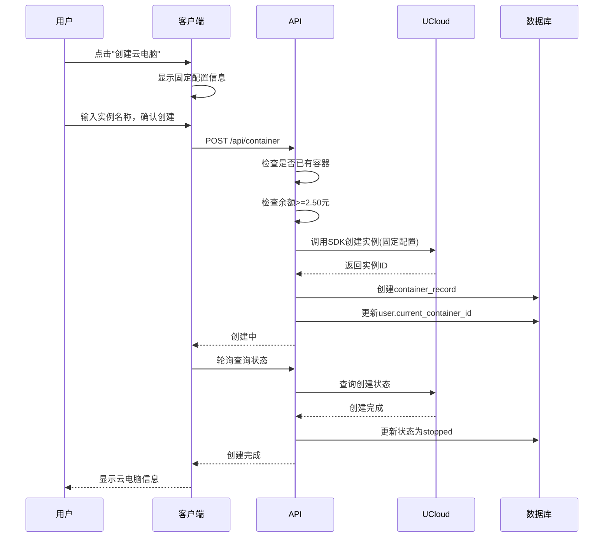
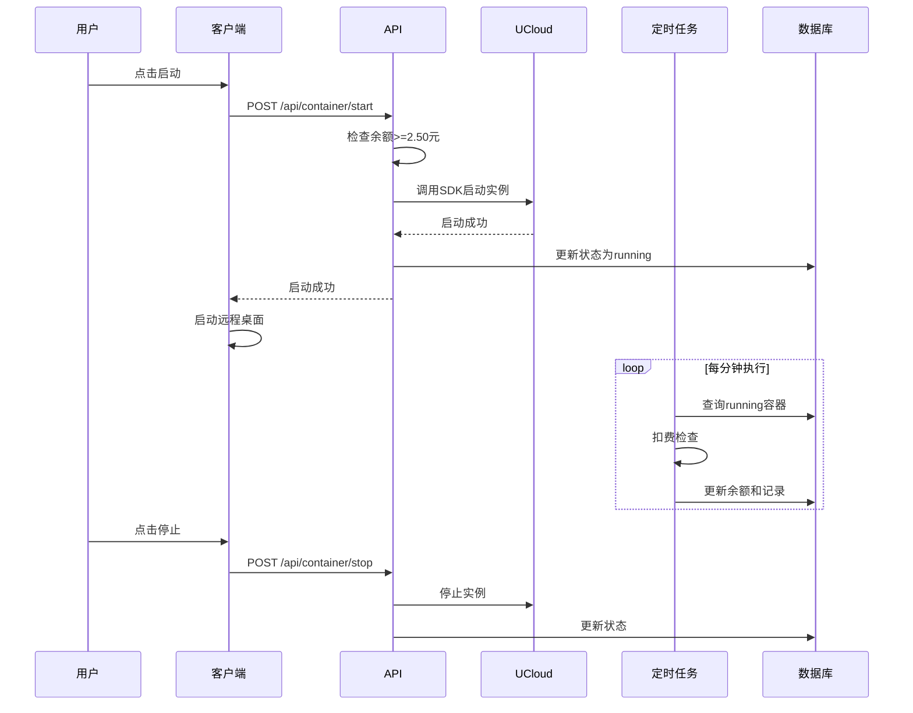
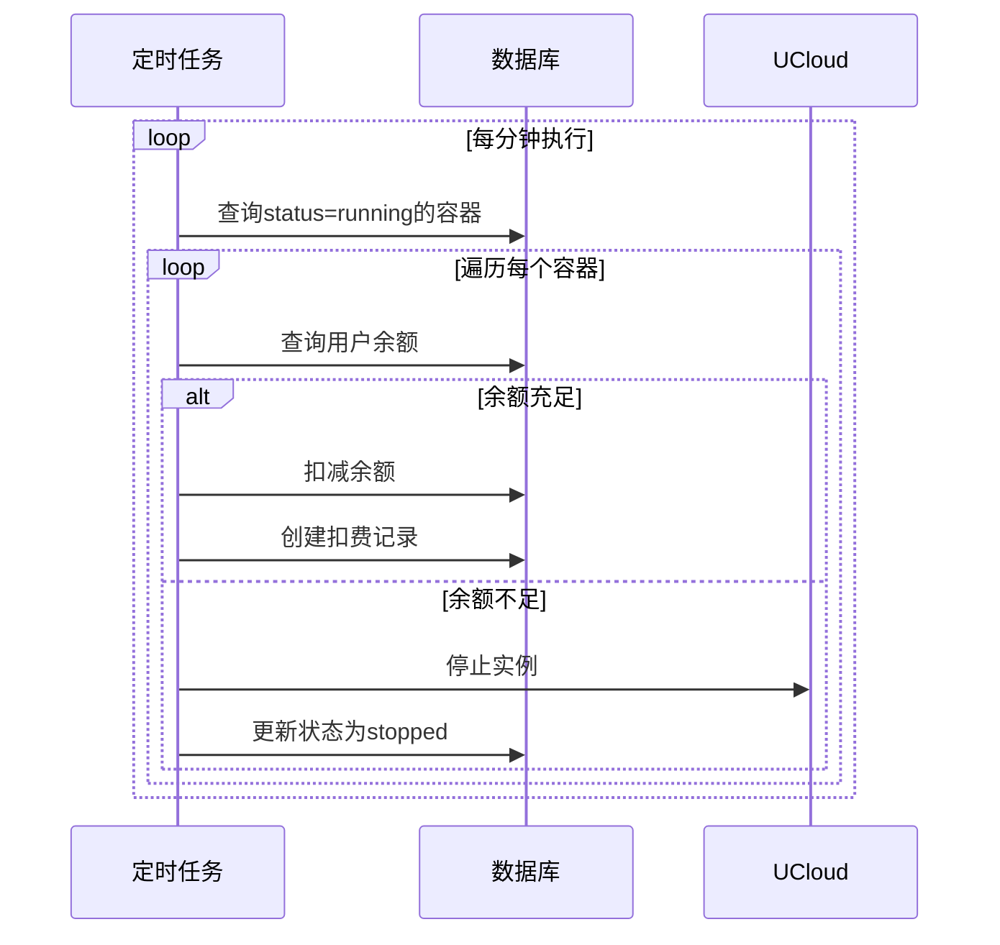

# 云电脑容器管理系统 - 完整设计文档

## 版本信息
- **版本**: v1.0
- **日期**: 2026-02-09
- **状态**: 设计完成

---

## 目录
1. [项目概述](#1-项目概述)
2. [核心业务逻辑](#2-核心业务逻辑)
3. [数据库设计](#3-数据库设计)
4. [API接口设计](#4-api接口设计)
5. [业务流程详解](#5-业务流程详解)
6. [后台管理功能](#6-后台管理功能)
7. [客户端设计](#7-客户端设计)
8. [定时任务](#8-定时任务)
9. [项目结构](#9-项目结构)
10. [关键业务规则](#10-关键业务规则)

---

## 1. 项目概述

### 1.1 项目核心特点
| 特性 | 说明 |
|------|------|
| 容器管理 | 基于UCloud的GPU云电脑服务 |
| 按需计费 | 按实际运行时长计费，每分钟自动扣费 |
| 1:1绑定 | 一个用户绑定一个云电脑实例 |
| 持久化实例 | 关机后保留实例状态和数据 |
| 固定配置 | 统一的硬件配置（3080Ti, 12核, 32GB, 200GB） |
| 日志记录 | 完整的操作日志和扣费记录追踪 |
| 权限管理 | 超级管理员 + 管理员 + 用户三级权限 |

### 1.2 技术栈

| 模块 | 技术 |
|------|------|
| 后端（服务端） | Python + FastAPI + SQLAlchemy + SQLite |
| 后台管理前端 | Vue 3 + Vite + Element Plus |
| 本地客户端 | Python + PySide6 |
| 认证 | JWT（PyJWT） |
| 云服务商 | UCloud SDK |

### 1.3 核心概念

- **用户**: 使用云电脑的企业客户，1:1绑定一个云电脑实例
- **超级管理员**: 系统最高权限，可管理所有管理员、设置价格、查看所有数据
- **管理员**: 可管理用户数据、充值余额、查看日志
- **云电脑实例**: UCloud提供的GPU云主机，按运行时长计费
- **固定配置**: 所有实例统一使用3080Ti GPU, 12核CPU, 32GB内存, 200GB SSD存储
- **每分钟价格**: 由超级管理员设置的系统全局价格（元/分钟）

---

## 2. 核心业务逻辑

### 2.1 绑定关系
```
用户(m_user) ←──1:1──→ 云电脑实例(container_record)
```

- 一个用户只能拥有一个非删除状态的云电脑实例
- 创建新实例前必须先删除旧实例
- 用户通过`current_container_id`字段关联当前实例

### 2.2 实例生命周期

```
┌─────────────────────────────────────────────────────────────────────┐
│                        实例状态流转图                                 │
└─────────────────────────────────────────────────────────────────────┘

创建实例
    ↓
已停止(stopped) ←──────┐
    ↓                  │
启动                  │
    ↓                  │
运行中(running) ───────┤
    ↓                  │
停止                  │
    ↓                  │
已停止(stopped) ───────┘
    ↓
删除实例
    ↓
已删除(deleted)
```

**状态说明**:
- **creating**: 创建中，等待UCloud返回
- **stopped**: 已停止，实例保留，数据不丢失，不计费
- **running**: 运行中，正常计费
- **stopping**: 停止中
- **starting**: 启动中
- **deleting**: 删除中
- **deleted**: 已删除，数据丢失
- **error**: 异常状态

### 2.3 计费模式

| 项目 | 说明 |
|------|------|
| 计费粒度 | 按分钟计费 |
| 扣费频率 | 每分钟自动扣费一次（后台定时任务） |
| 价格设置 | 超级管理员在系统配置中设置全局统一价 |
| 启动门槛 | 余额必须 >= 5分钟费用（防止频繁启停） |
| 余额不足 | 余额<=0时立即自动停止实例 |
| 价格快照 | 创建实例时记录当时的每分钟价格，防止中途调价 |

---

## 3. 数据库设计

### 3.1 用户表 (m_user)

```sql
CREATE TABLE m_user (
    id INTEGER PRIMARY KEY AUTOINCREMENT,
    company_name VARCHAR(100) NOT NULL COMMENT '公司名称',
    contact_name VARCHAR(50) NOT NULL COMMENT '联系人姓名',
    phone VARCHAR(20) NOT NULL UNIQUE COMMENT '联系电话（登录账号）',
    password_hash VARCHAR(255) NOT NULL COMMENT '密码哈希（bcrypt）',
    balance DECIMAL(10,2) DEFAULT 0.00 COMMENT '账号余额（元）',
    current_container_id INTEGER DEFAULT NULL COMMENT '当前绑定的容器ID',
    status INTEGER DEFAULT 1 COMMENT '状态：0-禁用, 1-正常',
    created_at DATETIME DEFAULT CURRENT_TIMESTAMP,
    updated_at DATETIME DEFAULT CURRENT_TIMESTAMP,
    last_login_at DATETIME DEFAULT NULL,
    
    FOREIGN KEY (current_container_id) REFERENCES container_record(id)
);

CREATE INDEX idx_user_phone ON m_user(phone);
CREATE INDEX idx_user_status ON m_user(status);
```

### 3.2 管理员表 (m_admin)

```sql
CREATE TABLE m_admin (
    id INTEGER PRIMARY KEY AUTOINCREMENT,
    username VARCHAR(50) NOT NULL UNIQUE COMMENT '管理员账号',
    password_hash VARCHAR(255) NOT NULL COMMENT '密码哈希',
    role VARCHAR(20) NOT NULL DEFAULT 'admin' COMMENT '角色：super_admin/admin',
    status INTEGER DEFAULT 1 COMMENT '状态：0-禁用, 1-正常',
    created_by INTEGER DEFAULT NULL COMMENT '创建者ID（超级管理员）',
    created_at DATETIME DEFAULT CURRENT_TIMESTAMP,
    updated_at DATETIME DEFAULT CURRENT_TIMESTAMP,
    last_login_at DATETIME DEFAULT NULL,
    last_login_ip VARCHAR(50) DEFAULT NULL,
    
    FOREIGN KEY (created_by) REFERENCES m_admin(id)
);

CREATE INDEX idx_admin_username ON m_admin(username);
CREATE INDEX idx_admin_role ON m_admin(role);
```

### 3.3 容器记录表 (container_record)

```sql
CREATE TABLE container_record (
    id INTEGER PRIMARY KEY AUTOINCREMENT,
    user_id INTEGER NOT NULL UNIQUE COMMENT '所属用户ID（1:1绑定）',
    ucloud_instance_id VARCHAR(100) NOT NULL COMMENT 'UCloud实例ID',
    instance_name VARCHAR(100) NOT NULL COMMENT '实例名称',
    status VARCHAR(20) NOT NULL DEFAULT 'creating' COMMENT '状态',
    gpu_type VARCHAR(50) NOT NULL DEFAULT '3080Ti' COMMENT 'GPU类型（固定）',
    cpu_cores INTEGER NOT NULL DEFAULT 12 COMMENT 'CPU核数（固定）',
    memory_gb INTEGER NOT NULL DEFAULT 32 COMMENT '内存大小GB（固定）',
    storage_gb INTEGER NOT NULL DEFAULT 200 COMMENT '存储大小GB（固定）',
    price_per_minute DECIMAL(10,4) NOT NULL COMMENT '创建时的每分钟价格',
    created_at DATETIME DEFAULT CURRENT_TIMESTAMP,
    started_at DATETIME DEFAULT NULL COMMENT '本次启动时间（用于计费）',
    stopped_at DATETIME DEFAULT NULL COMMENT '本次停止时间',
    deleted_at DATETIME DEFAULT NULL,
    total_running_minutes INTEGER DEFAULT 0 COMMENT '累计运行分钟数',
    total_cost DECIMAL(10,2) DEFAULT 0.00 COMMENT '累计消费金额',
    
    FOREIGN KEY (user_id) REFERENCES m_user(id),
    UNIQUE(user_id)
);

CREATE INDEX idx_container_user ON container_record(user_id);
CREATE INDEX idx_container_status ON container_record(status);
CREATE INDEX idx_container_ucloud_id ON container_record(ucloud_instance_id);
```

**硬件配置说明（固定）**:
- Zone: cn-wlcb-01
- MachineType: G
- CompShareImageId: compshareImage-1mnqn08rd1xz
- GPU: 1 x 3080Ti
- CPU: 12核
- 内存: 32GB
- 存储: 200GB SSD

### 3.4 系统配置表 (system_config)

```sql
CREATE TABLE system_config (
    id INTEGER PRIMARY KEY AUTOINCREMENT,
    config_key VARCHAR(50) NOT NULL UNIQUE COMMENT '配置项键名',
    config_value VARCHAR(255) NOT NULL COMMENT '配置项值',
    description TEXT COMMENT '配置描述',
    updated_by INTEGER DEFAULT NULL COMMENT '更新者ID',
    updated_at DATETIME DEFAULT CURRENT_TIMESTAMP,
    
    FOREIGN KEY (updated_by) REFERENCES m_admin(id)
);

-- 初始化数据
INSERT INTO system_config (config_key, config_value, description) VALUES
('price_per_minute', '0.5000', '云电脑每分钟价格（元）'),
('min_balance_to_start', '2.5000', '启动云电脑所需最低余额（5分钟费用）'),
('auto_stop_threshold', '0.0000', '自动停止余额阈值');
```

### 3.5 实时扣费记录表 (billing_charge_record)

```sql
CREATE TABLE billing_charge_record (
    id INTEGER PRIMARY KEY AUTOINCREMENT,
    user_id INTEGER NOT NULL COMMENT '用户ID',
    container_id INTEGER NOT NULL COMMENT '容器ID',
    charge_minute DATETIME NOT NULL COMMENT '扣费的这一分钟（精确到分钟）',
    price_per_minute DECIMAL(10,4) NOT NULL COMMENT '当时每分钟价格',
    amount DECIMAL(10,4) NOT NULL COMMENT '扣费金额',
    balance_before DECIMAL(10,2) NOT NULL COMMENT '扣费前余额',
    balance_after DECIMAL(10,2) NOT NULL COMMENT '扣费后余额',
    created_at DATETIME DEFAULT CURRENT_TIMESTAMP,
    
    FOREIGN KEY (user_id) REFERENCES m_user(id),
    FOREIGN KEY (container_id) REFERENCES container_record(id)
);

CREATE INDEX idx_charge_user ON billing_charge_record(user_id);
CREATE INDEX idx_charge_container ON billing_charge_record(container_id);
CREATE INDEX idx_charge_minute ON billing_charge_record(charge_minute);
```

### 3.6 余额变动记录表 (balance_log)

```sql
CREATE TABLE balance_log (
    id INTEGER PRIMARY KEY AUTOINCREMENT,
    user_id INTEGER NOT NULL COMMENT '用户ID',
    change_type VARCHAR(20) NOT NULL COMMENT '变动类型：recharge/deduct/refund',
    amount DECIMAL(10,2) NOT NULL COMMENT '变动金额（正数充值，负数扣费）',
    balance_before DECIMAL(10,2) NOT NULL,
    balance_after DECIMAL(10,2) NOT NULL,
    related_id INTEGER DEFAULT NULL COMMENT '关联记录ID',
    description TEXT COMMENT '描述说明',
    operator_id INTEGER DEFAULT NULL COMMENT '操作人ID',
    operator_type VARCHAR(20) DEFAULT 'user' COMMENT '操作人类型',
    created_at DATETIME DEFAULT CURRENT_TIMESTAMP,
    
    FOREIGN KEY (user_id) REFERENCES m_user(id),
    FOREIGN KEY (operator_id) REFERENCES m_admin(id)
);

CREATE INDEX idx_balance_user ON balance_log(user_id);
CREATE INDEX idx_balance_type ON balance_log(change_type);
```

### 3.7 容器操作日志表 (container_log)

```sql
CREATE TABLE container_log (
    id INTEGER PRIMARY KEY AUTOINCREMENT,
    user_id INTEGER NOT NULL COMMENT '操作用户ID',
    container_id INTEGER NOT NULL COMMENT '容器ID',
    action VARCHAR(50) NOT NULL COMMENT '操作：create/start/stop/delete/connect',
    action_status VARCHAR(20) NOT NULL COMMENT '状态：success/failed/pending',
    request_data TEXT COMMENT '请求参数（JSON）',
    response_data TEXT COMMENT '响应数据（JSON）',
    error_message TEXT COMMENT '错误信息',
    ip_address VARCHAR(50) COMMENT '操作IP',
    user_agent TEXT COMMENT '客户端信息',
    created_at DATETIME DEFAULT CURRENT_TIMESTAMP,
    
    FOREIGN KEY (user_id) REFERENCES m_user(id),
    FOREIGN KEY (container_id) REFERENCES container_record(id)
);

CREATE INDEX idx_container_log_user ON container_log(user_id);
CREATE INDEX idx_container_log_container ON container_log(container_id);
```

### 3.8 管理员操作日志表 (admin_operation_log)

```sql
CREATE TABLE admin_operation_log (
    id INTEGER PRIMARY KEY AUTOINCREMENT,
    admin_id INTEGER NOT NULL COMMENT '操作管理员ID',
    action VARCHAR(50) NOT NULL COMMENT '操作类型',
    target_type VARCHAR(50) NOT NULL COMMENT '操作对象类型',
    target_id INTEGER COMMENT '操作对象ID',
    old_value TEXT COMMENT '修改前数据（JSON）',
    new_value TEXT COMMENT '修改后数据（JSON）',
    description TEXT COMMENT '操作描述',
    ip_address VARCHAR(50),
    created_at DATETIME DEFAULT CURRENT_TIMESTAMP,
    
    FOREIGN KEY (admin_id) REFERENCES m_admin(id)
);

CREATE INDEX idx_admin_log_admin ON admin_operation_log(admin_id);
```

---

## 4. API接口设计

### 4.1 认证相关

#### 用户登录
```http
POST /api/auth/login
Content-Type: application/json

{
    "phone": "13800138000",
    "password": "user_password"
}
```

#### 管理员登录
```http
POST /api/auth/admin/login
Content-Type: application/json

{
    "username": "admin",
    "password": "admin_password"
}
```

### 4.2 用户相关（客户端）

#### 获取当前用户信息
```http
GET /api/user/me
Authorization: Bearer {token}
```

#### 获取余额和消费统计
```http
GET /api/user/statistics
Authorization: Bearer {token}
```

### 4.3 容器相关（客户端）

#### 获取我的云电脑
```http
GET /api/container/my
Authorization: Bearer {token}
```

#### 获取实时状态
```http
GET /api/container/my/status
Authorization: Bearer {token}
```

#### 创建云电脑
```http
POST /api/container
Authorization: Bearer {token}
Content-Type: application/json

{
    "instance_name": "云电脑-ABC公司"
}

响应:
{
    "code": 200,
    "message": "云电脑创建中",
    "data": {
        "container_id": 1,
        "status": "creating",
        "estimated_time": 120
    }
}
```

**说明**: 云电脑使用固定配置创建，无需选择硬件参数：
- GPU: NVIDIA 3080Ti x 1
- CPU: 12核
- 内存: 32GB
- 存储: 200GB SSD

**错误响应**:
```json
{
    "code": 400,
    "message": "您已有一个云电脑实例，请先删除后再创建",
    "error_code": "CONTAINER_ALREADY_EXISTS"
}
```

#### 启动云电脑
```http
POST /api/container/start
Authorization: Bearer {token}
```

#### 停止云电脑
```http
POST /api/container/stop
Authorization: Bearer {token}
```

#### 删除云电脑
```http
DELETE /api/container
Authorization: Bearer {token}

请求体:
{
    "confirm": true
}
```

#### 获取连接信息
```http
GET /api/container/connection
Authorization: Bearer {token}
```

### 4.4 账单相关（客户端）

#### 获取扣费记录
```http
GET /api/billing/charges?page=1&page_size=20
Authorization: Bearer {token}
```

#### 获取余额变动记录
```http
GET /api/billing/balance-logs?page=1&page_size=20
Authorization: Bearer {token}
```

### 4.5 系统配置（超级管理员）

#### 获取系统配置
```http
GET /api/admin/config
Authorization: Bearer {admin_token}
```

#### 更新每分钟价格
```http
PUT /api/admin/config/price
Authorization: Bearer {admin_token}
Content-Type: application/json

{
    "price_per_minute": 0.60
}
```

### 4.6 用户管理（管理员）

#### 获取用户列表
```http
GET /api/admin/users?page=1&page_size=20
Authorization: Bearer {admin_token}
```

#### 创建用户
```http
POST /api/admin/users
Authorization: Bearer {admin_token}
Content-Type: application/json

{
    "company_name": "XYZ公司",
    "contact_name": "李四",
    "phone": "13900139000",
    "password": "initial_password",
    "initial_balance": 0.00
}
```

#### 充值余额
```http
POST /api/admin/users/{user_id}/balance
Authorization: Bearer {admin_token}
Content-Type: application/json

{
    "type": "recharge",
    "amount": 100.00,
    "description": "春节活动赠送"
}
```

#### 删除用户
```http
DELETE /api/admin/users/{user_id}
Authorization: Bearer {super_admin_token}
```

**说明**:
- 仅超级管理员可执行删除操作
- 如果用户存在云电脑实例，则不允许删除（需先删除云电脑）

**错误响应**:
```json
{
    "code": 400,
    "message": "该用户存在云电脑，请先删除云电脑后再删除用户"
}
```

### 4.7 仪表盘统计（管理员）

#### 获取系统概览
```http
GET /api/admin/dashboard
Authorization: Bearer {admin_token}
```

---

## 5. 业务流程详解

### 5.1 创建云电脑流程



**固定配置参数**:
- Zone: cn-wlcb-01
- MachineType: G
- CompShareImageId: compshareImage-1mnqn08rd1xz
- GPU: 1 x 3080Ti
- CPU: 12核
- Memory: 32768MB (32GB)
- Disk: 200GB SSD

### 5.2 日常使用流程



### 5.3 每分钟扣费流程



---

## 6. 后台管理功能

### 6.1 仪表盘
- 用户总数、容器总数、运行中容器数
- 今日收入、总余额
- 近7天收入趋势图
- 容器状态分布

### 6.2 用户管理
- 用户列表（搜索、筛选、分页）
- 创建/编辑用户
- 余额充值/扣减
- 重置用户密码
- 删除用户（仅超级管理员，需先删除云电脑）
- 查看用户详情和消费统计
- 强制停止运行中的容器

### 6.3 管理员管理（仅超级管理员）
- 管理员列表
- 创建/编辑管理员
- 重置密码
- 禁用/启用账号

### 6.4 系统配置（仅超级管理员）
- 每分钟价格设置
- 启动最低余额设置
- 配置修改历史

### 6.5 日志中心
- 容器操作日志
- 余额变动日志
- 管理员操作日志
- 扣费记录查询

---

## 7. 客户端设计

### 7.1 架构设计

```
client/
├── main.py              # 应用入口
├── api/
│   └── client.py       # HTTP客户端
└── ui/                 # 界面组件
```

### 7.2 界面设计

#### 登录界面
- Logo和公司名称
- 手机号、密码输入
- 记住密码选项

#### 主界面
- **顶部栏**: 公司名称、余额、退出按钮
- **主体区**: 云电脑状态卡片
  - 运行状态显示
  - 固定配置信息展示（3080Ti/12核/32GB/200GB）
  - 本次运行时长和消费
  - 剩余可用时间
  - 连接信息（IP、端口、用户名、密码）
  - 操作按钮（启动/停止/连接/删除）

#### 创建云电脑向导
由于使用固定配置，向导简化为：
- **配置展示**: 显示固定硬件配置（只读）
  - GPU: NVIDIA 3080Ti x 1
  - CPU: 12核
  - 内存: 32GB
  - 存储: 200GB SSD
- **实例名称**: 输入框（必填）
- **确认创建**: 按钮

#### 运行中状态界面
```
+--------------------------------------------------+
|  公司名称: ABC公司      余额: ¥77.50     [退出]  |
+--------------------------------------------------+
|                                                  |
|  +--------------------------------------------+  |
|  |           云电脑运行中                      |  |
|  |                                            |  |
|  |  状态: 运行中 [● 绿色]                     |  |
|  |                                            |  |
|  |  配置: 3080Ti GPU, 12核CPU, 32GB内存       |  |
|  |          200GB SSD                         |  |
|  |                                            |  |
|  +--------------------------------------------+  |
|  +--------------------------------------------+  |
|  |           实时计费信息                      |  |
|  |                                            |  |
|  |  本次运行: 45分钟                           |  |
|  |  本次消费: ¥22.50                          |  |
|  |  每分钟: ¥0.50                             |  |
|  |                                            |  |
|  |  剩余可用: 2小时35分钟                      |  |
|  |                                            |  |
|  +--------------------------------------------+  |
|                                                  |
|  [连接云电脑]  [停止]                           |
|                                                  |
+--------------------------------------------------+
```

### 7.3 实时状态更新
- 每60秒轮询一次状态
- 实时显示余额和剩余时间
- 余额不足预警（<5分钟时提示）

---

## 8. 定时任务

### 8.1 每分钟扣费任务

```python
async def minute_billing_task():
    """每分钟扣费任务"""
    async with get_db() as db:
        running_containers = await get_running_containers(db)
        
        for container in running_containers:
            user = await get_user(db, container.user_id)
            price = await get_current_price(db)
            
            if user.balance < price:
                # 余额不足，停止实例
                await stop_instance(container)
            else:
                # 执行扣费
                await charge_fee(user, container, price)
```

### 8.2 其他定时任务
- 清理过期日志（每天凌晨3点）
- 生成日报（每天凌晨1点）

---

## 9. 项目结构

```
cloud-pc-management/
├── backend/                    # FastAPI后端
│   ├── app/
│   │   ├── api/               # API路由
│   │   ├── models/            # SQLAlchemy模型
│   │   ├── services/          # 业务逻辑
│   │   ├── tasks/             # 定时任务
│   │   └── core/              # 核心配置
│   ├── requirements.txt
│   └── run.py
│
├── admin-frontend/             # Vue3后台管理
│   ├── src/
│   │   ├── api/              # API接口
│   │   ├── views/            # 页面组件
│   │   └── stores/           # Pinia状态
│   └── package.json
│
├── client/                     # PySide6客户端
│   ├── api/
│   ├── ui/
│   └── main.py
│
├── test_api.py                # API测试
├── test_container_api.py      # 容器API测试
├── test_delete_user.py        # 删除用户API测试
├── test_client.py             # 客户端测试
└── AGENTS.md                  # 开发规范
```

---

## 10. 关键业务规则

### 10.1 计费规则
| 规则项 | 说明 |
|--------|------|
| 计费粒度 | 按分钟计费 |
| 扣费频率 | 每分钟自动扣费 |
| 价格快照 | 创建时记录价格，不受后续调价影响 |
| 启动门槛 | 余额 >= 2.50元（5分钟费用） |
| 自动停止 | 余额不足时自动停止 |

### 10.2 容器配置规则
| 配置项 | 固定值 | 说明 |
|--------|--------|------|
| Zone | cn-wlcb-01 | 乌兰察布一区 |
| MachineType | G | GPU机型 |
| Image | compshareImage-1mnqn08rd1xz | 共享镜像 |
| GPU | 3080Ti x 1 | NVIDIA显卡 |
| CPU | 12核 | 固定12核 |
| 内存 | 32GB | 固定32GB |
| 存储 | 200GB SSD | 系统盘 |

### 10.3 权限规则
| 角色 | 权限 |
|------|------|
| 用户 | 管理自己的云电脑、查看账单 |
| 管理员 | 管理用户、充值、查看日志、重置用户密码 |
| 超级管理员 | 所有权限 + 管理管理员 + 系统配置 + 删除用户 |

### 10.4 状态流转规则
- stopped → running: 启动（检查余额）
- running → stopped: 停止或余额不足
- stopped → deleted: 删除

---

## 附录

### A. 状态码定义
| 状态码 | 说明 |
|--------|------|
| 200 | 成功 |
| 400 | 请求参数错误 |
| 401 | 未认证 |
| 403 | 无权限 |
| 404 | 资源不存在 |
| 402 | 余额不足 |
| 500 | 服务器错误 |

### B. 错误码定义
| 错误码 | 说明 |
|--------|------|
| CONTAINER_ALREADY_EXISTS | 已存在容器实例 |
| INSUFFICIENT_BALANCE | 余额不足 |
| CONTAINER_NOT_FOUND | 容器不存在 |
| INVALID_STATUS | 状态不允许此操作 |
| UCLOUD_API_ERROR | UCloud API调用失败 |

### C. 默认账号
- **超级管理员**: admin / Admin123@
- **管理员**: 由超级管理员创建
- **用户**: 由管理员创建
